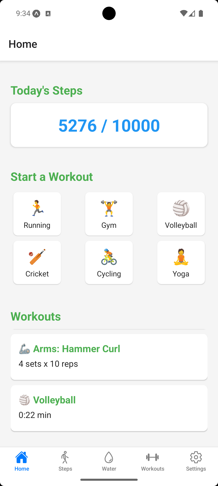
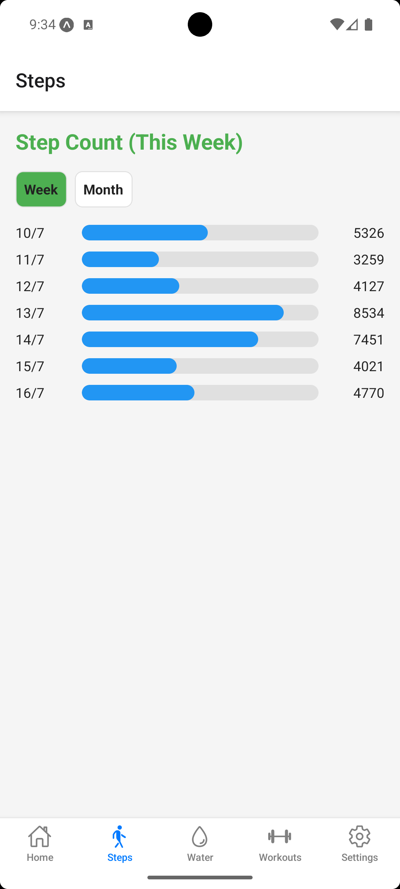
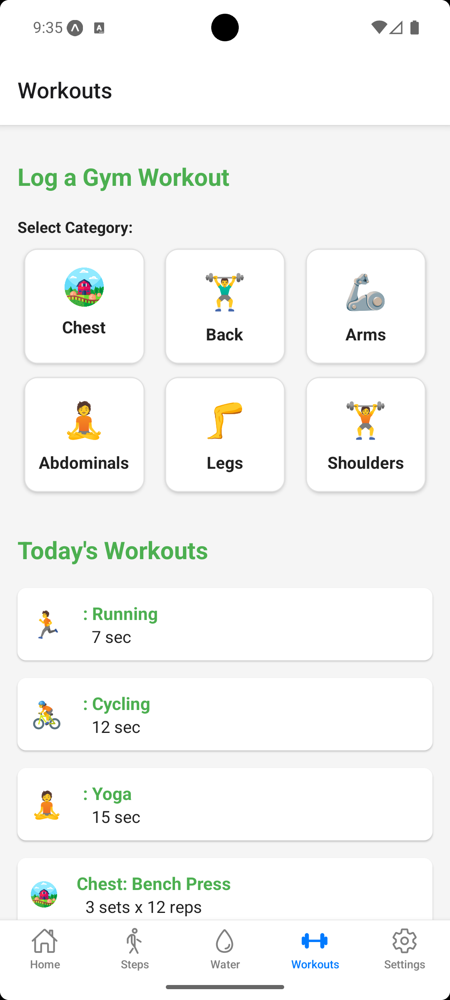
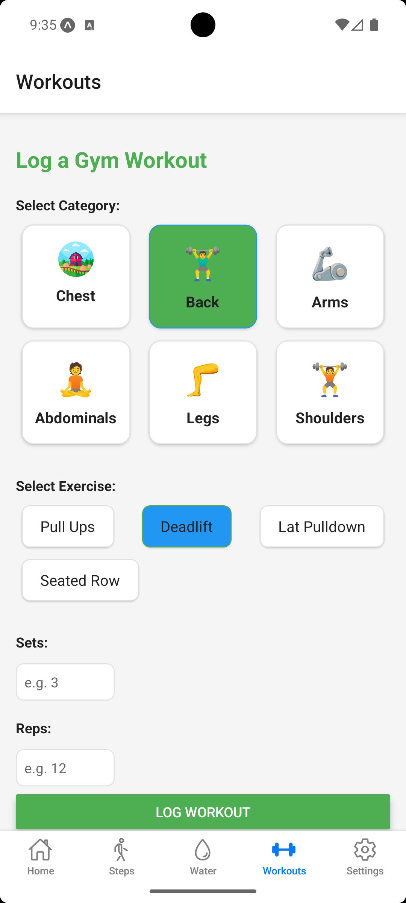
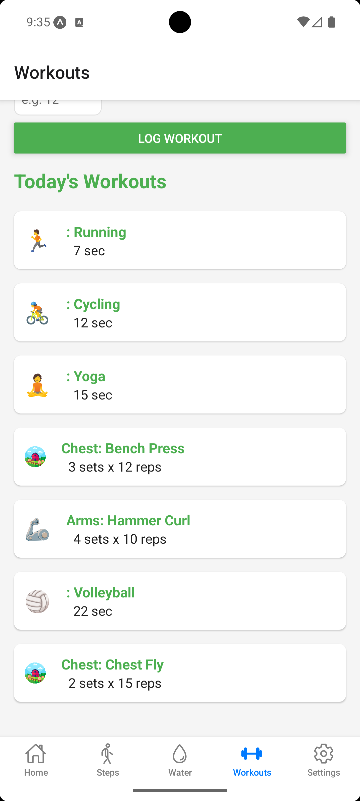
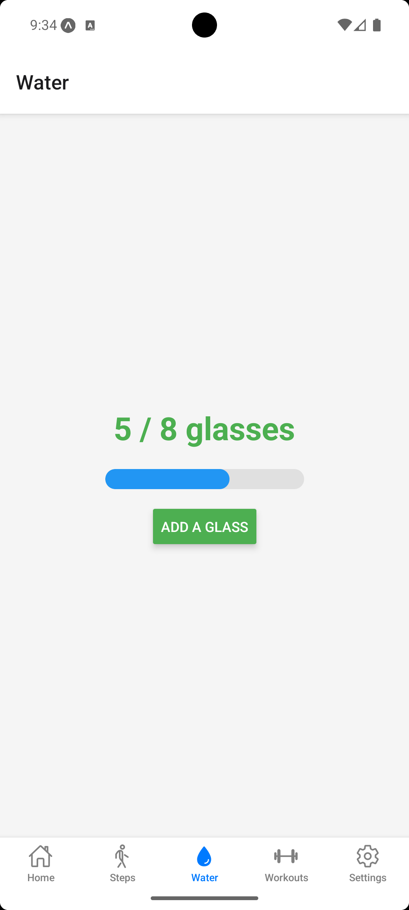
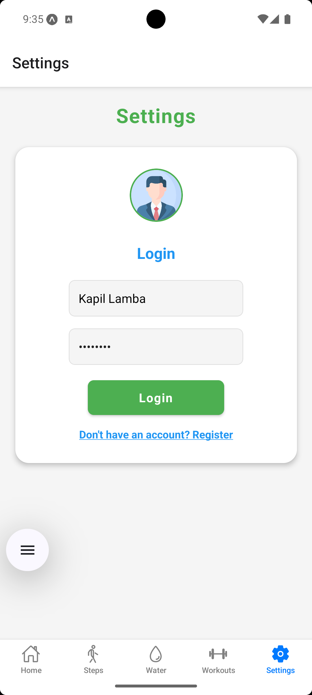
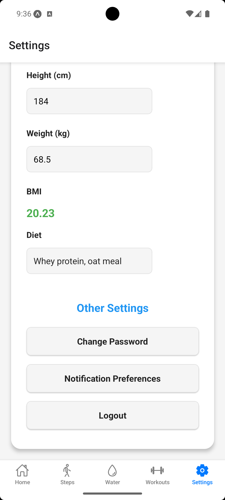
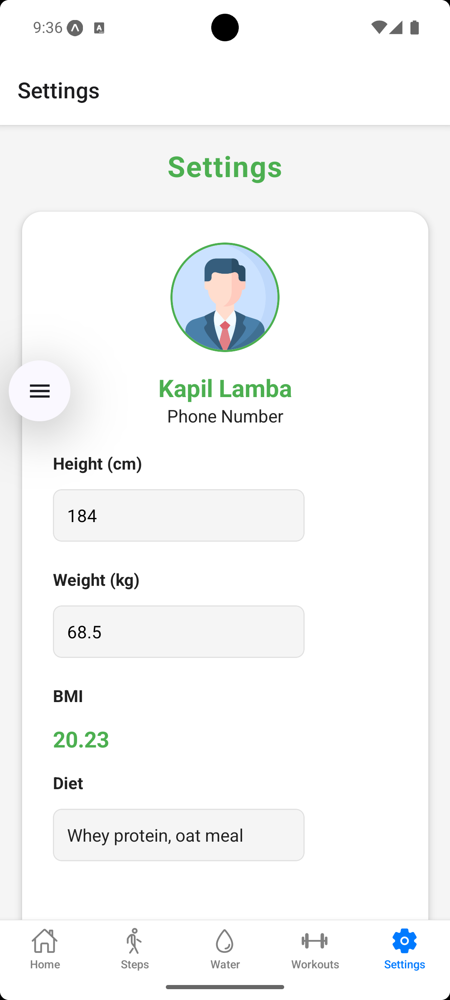

# FitnessTrackerApp

A React Native app to track workouts, steps, and water intake.

## Features

- Log gym workouts with sets, reps, and time
- Track daily steps
- Monitor water intake
- View workout history
- Manage profile and settings

## Screenshots

### Home Page


### Steps Page


### Workout Page


### Log Workout


### Today's Workouts


### Water Intake Page


### Settings Page


### Change Password Setting


### Profile


## Getting Started

1. Clone the repo:
   ```bash
   git clone https://github.com/kapillamba08/FitnessTrackerApp.git
   ```
2. Install dependencies:
   ```bash
   cd FitnessTrackerApp/project
   npm install
   ```
3. Run the app:
   ```bash
   npm start
   ```

## License

MIT